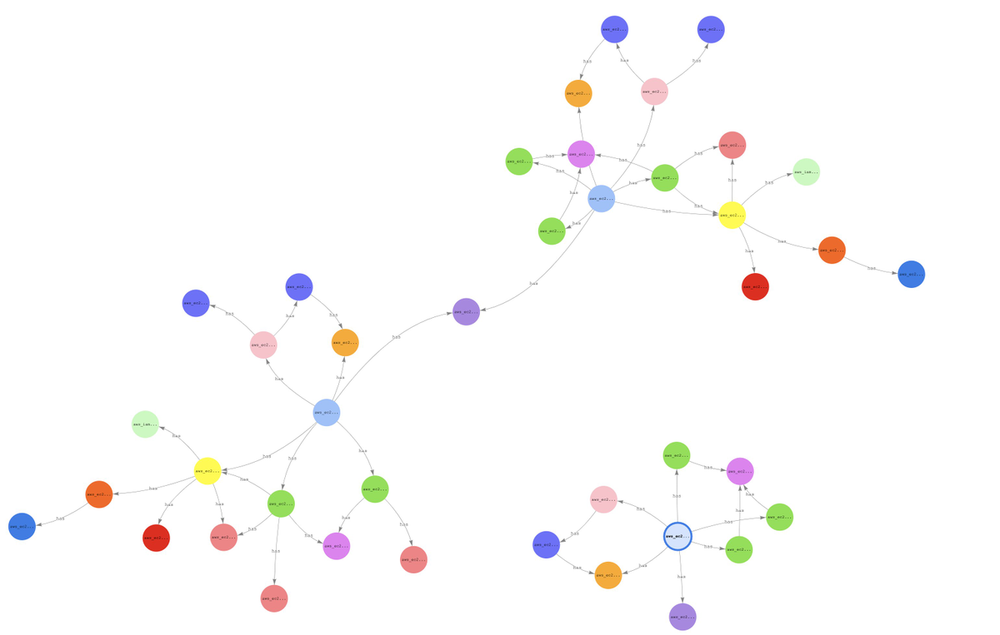
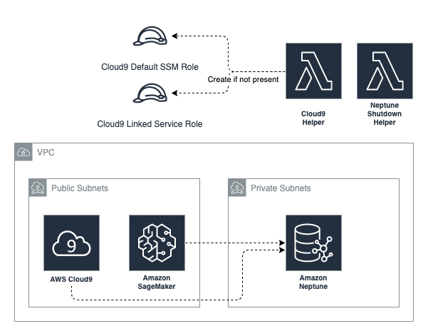
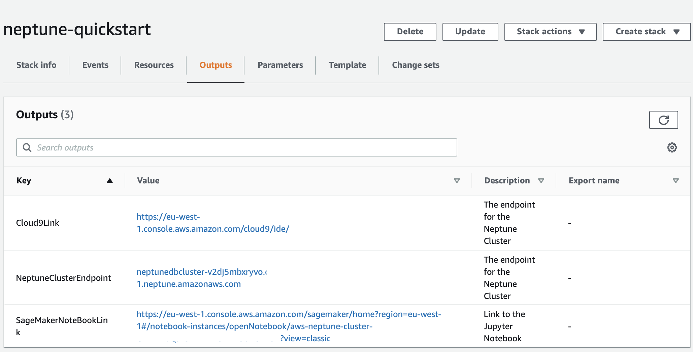
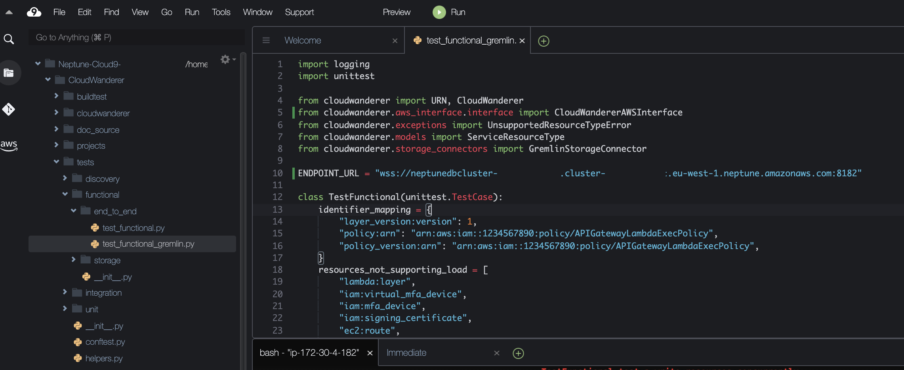
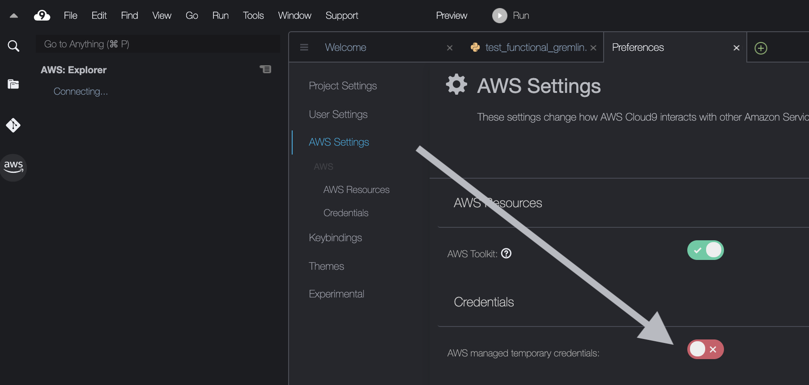
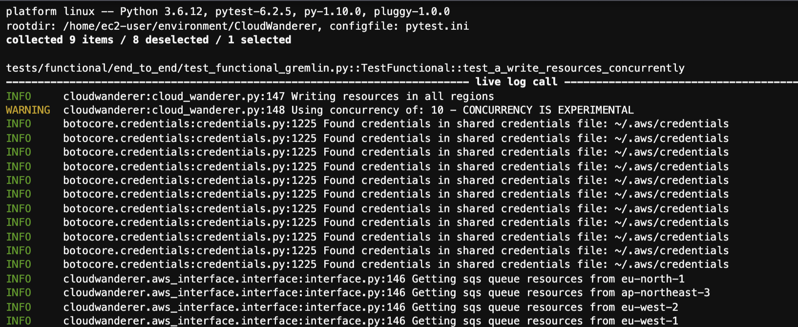
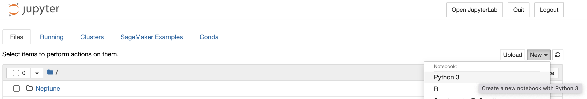
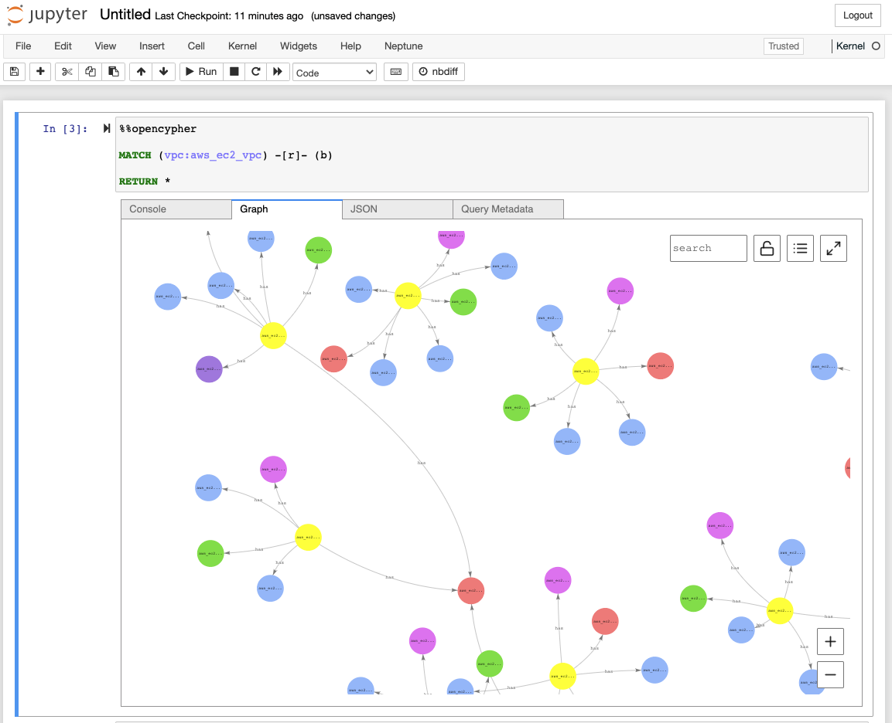

Neptune Quickstart
=======================

To get started with using CloudWanderer with the Gremlin Connector in order to see the power of 
GraphDBs quickly we've created the `neptune-quickstart cloudformation template <https://github.com/CloudWanderer-io/neptune-quickstart>`__.

With this deployment you'll be able to quickly run CloudWanderer in your own AWS environment
and run both OpenCypher and Gremlin queries against the data to see the real power of treating your resources as vertices on a graph. 

Launch your CloudFormation Stack
----------------------------------
First off, let's start by visiting the `neptune-quickstart repo <https://github.com/CloudWanderer-io/neptune-quickstart>`__ and 
clicking on the "Launch Stack" button for your favourite region.

.. warning:: 

    This will launch a Neptune database, Cloud9 IDE, and Sagemaker Notebook in your AWS account. These resources incur small amounts of cost
    even though they are configured to shut down automatically and are sized to the smallest instances. Please read the details of the 
    `neptune-quickstart repo <https://github.com/CloudWanderer-io/neptune-quickstart>`__  for more information.

Once this stack has completed deployment (which will take about 20 minutes so you may want to make some coffee at this point), you can 
navigate to the Outputs tab and open the ``Cloud9Link`` and ``SageMakerNotebookLink`` urls in new tabs.

Take note of that ``NeptuneClusterEndpoint`` value as we'll be using this in a moment!

Cloud9 Setup
-------------------

Once you're in your Cloud9 IDE, open up the terminal and type the following commands.

.. code:: shell

    git clone https://github.com/CloudWanderer-io/CloudWanderer.git
    cd CloudWanderer
    python -m venv .venv
    source .venv/bin/activate
    pip install --upgrade pip
    pip install -r requirements.txt 
    export AWS_DEFAULT_REGION=$(curl http://169.254.169.254/latest/meta-data/placement/availability-zone -s | sed -E 's/[a-z]$//')

Once that's complete, open up ``./tests/functional/end_to_end/test_functional_gremlin.py`` and locate the ``ENDPOINT_URL`` global variable and
update it to reflect your stack's endpoint url.

.. tip::

    Make sure your ``ENDPOINT_URL`` is prefixed with ``wss://`` **not** ``ws://`` as AWS Neptune uses SSL!

Finally, disabled AWS temporary credentials by clicking on the cog icon in the top right to go to Preferences, then click on AWS Settings and disable
AWS managed temporary credentials.

Running CloudWanderer
-----------------------

Now you can run CloudWanderer!

.. code:: 

    pytest tests/functional/end_to_end/test_functional_gremlin.py -k concurrently

    
.. tip::

    If you get an error ``An error occurred (InvalidClientTokenId) when calling the GetGroupPolicy operation: The security token included in the request is invalid``
    make sure you disabled AWS managed temporary credentials in the Cloud9 setup above!

Querying Neptune
-------------------

You can now go to your Sagemaker Notebook link from earlier and create a new Python3 notebook.

Now in your new Jupyter Notebook cell enter in the following:

.. code::

    %%opencypher

    MATCH (vpc:aws_ec2_vpc) -[r]- (b)

    RETURN *

This will tell the notebook to query Neptune using OpenCypher and return every vertex that has an edge with any VPC in your AWS account.

Voila! Now you need to learn OpenCypher, Gremlin, or SparQL to query your new graph!
We recommend OpenCypher as it's the easiest to use, especially if you're familiar with writing SQL queries.

Additional Reading
--------------------

- `Neo4j Sandbox is a great place to get started learning Cypher <https://neo4j.com/sandbox/>`__
- `AWS Neptune's OpenCypher differs from the OpenCypher spec in some important ways <https://docs.aws.amazon.com/neptune/latest/userguide/access-graph-opencypher-limitations.html>`__
- `Kevin Lawrence's Gremlin Graph Guide is an excellent resource for learning Gremlin <https://kelvinlawrence.net/book/Gremlin-Graph-Guide.html>`__
- `AWS Neptune's Gremlin has some restrictions <https://docs.aws.amazon.com/neptune/latest/userguide/access-graph-gremlin-differences.html>`__
