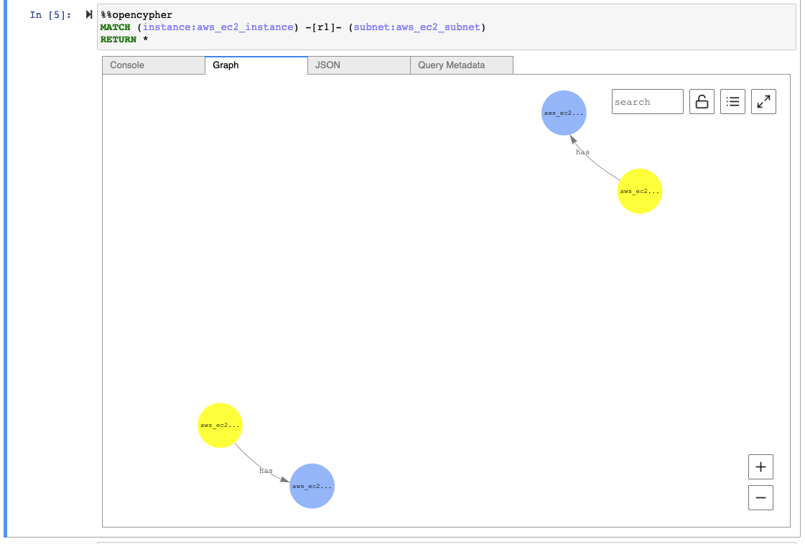
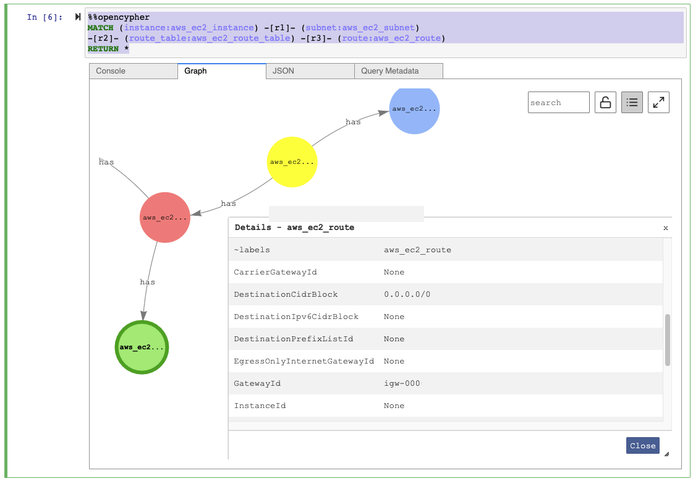
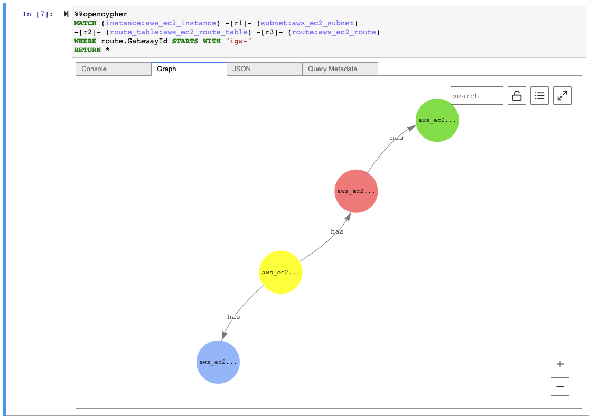

OpenCypher Examples
=========================

Pre-requisites
-----------------

In order to be able to run the OpenCypher queries you must have followed the :doc:`neptune_quickstart` guide.

Which EC2 Instances are in Public Subnets?
-----------------------------------------------------------

Let's start by looking at what EC2 instances we have.

.. code-block::

    %%opencypher
    MATCH (instance:aws_ec2_instance)
    RETURN *

The ``instance`` in ``(instance:ec2_instances)`` is a variable name we can use later, 
and the ``aws_ec2_instances`` is the label we're search for (i.e. the type of resource).

.. image:: images/opencypher_match_ec2_instances.png

You can click on the Graph tab, then select a node (or 'vertex' in graph database terms!) then click on the icon in
the top right with three lines and three dots to see all the attributes for that vertex.

Now let's find out what subnets those ec2 instances are in.

.. code-block::

    %%opencypher
    MATCH (instance:aws_ec2_instance) -[r1]- (subnet:aws_ec2_subnet)
    RETURN *

The ``r1`` inside the square brackets is the variable name for the _relationships_ that exist between 
our ec2 instances and their subnets.

The next step is to look at the routes these subnets have access to.

.. code-block:: 

    %%opencypher
    MATCH (instance:aws_ec2_instance) -[r1]- (subnet:aws_ec2_subnet)
    -[r2]- (route_table:aws_ec2_route_table) -[r3]- (route:aws_ec2_route)
    RETURN *

We're now chaining two additional relationships, from subnets to route tables, from route tables to individual routes.

Now we want to filter that down to only show routes that have a destination of an internet gateway!

.. code-block::

    %%opencypher
    MATCH (instance:aws_ec2_instance) -[r1]- (subnet:aws_ec2_subnet)
    -[r2]- (route_table:aws_ec2_route_table) -[r3]- (route:aws_ec2_route)
    WHERE route.GatewayId STARTS WITH "igw-"
    RETURN *

We are here adding a ``WHERE`` which references the ``GatewayId`` property on the ``route`` variable 
that refers to our ``aws_ec2_route`` nodes and filtering it to only show us ones that start with ``igw-``
(i.e. that are Routes out via an internet gateway).

Voila! We've done it! We've identified all EC2 instances in public subnets by traversing through the resources that 
are related to our instances using OpenCypher!

Additional Reading
---------------------

- `Neo4j Sandbox is a great place to get started learning Cypher <https://neo4j.com/sandbox/>`__
