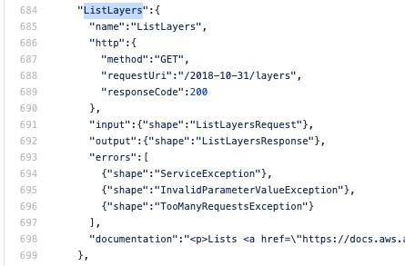
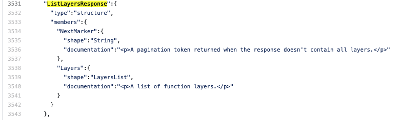
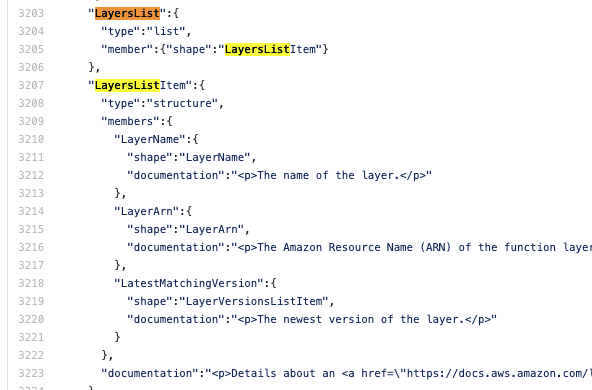
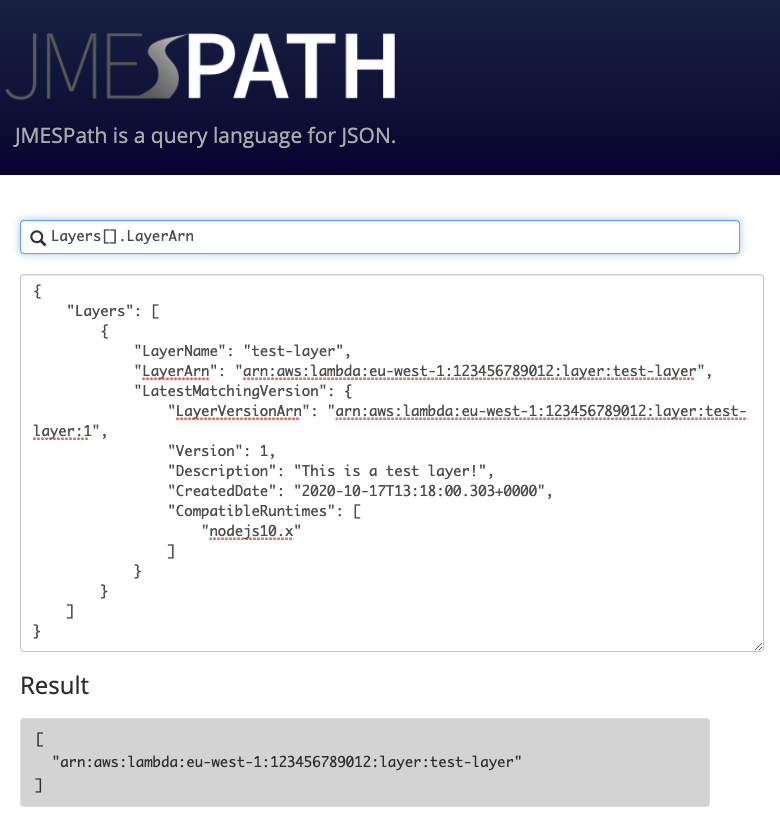

Writing a Custom Resource
======================================

In this example  we're going to write a custom resource for Lambda Layers.

.. note::

    Before getting started you should *definitely* check out :doc:`anatomy_of_a_custom_resource` to get an overview of the data structure we are going to build.

Get the metadata
---------------------

First we're going to use the AWS CLI to get an example response JSON for the API call we need to make to list Lambda Layers

.. code-block:: shell

    $ aws lambda list-layers
    {
        "Layers": [
            {
                "LayerName": "test-layer",
                "LayerArn": "arn:aws:lambda:eu-west-1:123456789012:layer:test-layer",
                "LatestMatchingVersion": {
                    "LayerVersionArn": "arn:aws:lambda:eu-west-1:123456789012:layer:test-layer:1",
                    "Version": 1,
                    "Description": "This is a test layer!",
                    "CreatedDate": "2020-10-17T13:18:00.303+0000",
                    "CompatibleRuntimes": [
                        "nodejs10.x"
                    ]
                }
            }
        ]
    }

Create the tests
--------------------

We can now use this to build ``TestLambdaLayers`` in ``tests/integration/custom_resources/lambda/test_lambda_layers.py``.

We need to populate the following attributes in this class:

* ``mock``
* ``expected_result``
* ``single_resource_scenarios``
* ``multiple_resource_scenarios``

We don't actually need to specify any tests as the scenarios we specify
will be run automatically will be run by the ``NoMotoMock`` mixin we're inheriting from.

Populate the mock
""""""""""""""""""""""
.. code-block:: python

    class TestLambdaLayers(NoMotoMock, unittest.TestCase):
        layer_payload = {
            "LayerName": "test-layer",
            "LayerArn": "arn:aws:lambda:eu-west-1:123456789012:layer:test-layer",
            "LatestMatchingVersion": {
                "LayerVersionArn": "arn:aws:lambda:eu-west-1:123456789012:layer:test-layer:1",
                "Version": 1,
                "Description": "This is a test layer!",
                "CreatedDate": "2020-10-17T13:18:00.303+0000",
                "CompatibleRuntimes": ["nodejs10.x"],
            },
        }

        mock = {
            "lambda": {
                "list_layers.return_value": {
                   "Layers": [layer_payload],
                }
            }
        }

We're populating the ``return_value`` of ``list_layers`` as this is the name of the Boto3 client method that
will be used internally to fetch the resource. We don't need to worry about handling pagination as this is
handled for us by the ``NoMotoMock`` mixin.

Populate the scenarios
"""""""""""""""""""""""""""

Now we need to populate our scenarios.

* Single resource scenarios
    These scenarios are the expected argument and return values from :class:`~cloudwanderer.cloud_wanderer.CloudWanderer.write_resource`.
    Lambda Layers do not have a ``Describe*`` API call and there is no other way to retrieve the metadata for a specific layer without listing
    all of them. This means that our ``expected_results`` value for ``single_resource_scenario`` is :class:`~cloudwanderer.exceptions.UnsupportedResourceTypeError`.
* Multiple resource scenarios
    These scenarios are the expected argument and return values from :class:`~cloudwanderer.cloud_wanderer.CloudWanderer.write_resources`.
    Because we split out our ``return_value`` into a separate ``layer_payload`` property when we set up the mockdata, we can re-use that as our ``expected_results`` value for the ``multiple_resource_scenarios``.

.. code-block:: python

    class TestLambdaLayers(NoMotoMock, unittest.TestCase):
        ...
        single_resource_scenarios = [
            SingleResourceScenario(
                urn=URN.from_string("urn:aws:123456789012:eu-west-1:lambda:layer:test-layer"),
                expected_results=UnsupportedResourceTypeError,
            )
        ]
        multiple_resource_scenarios = [
            MultipleResourceScenario(
                arguments=CloudWandererCalls(regions=["eu-west-1"], service_names=["lambda"], resource_types=["layer"]),
                expected_results=[layer_payload],
            )
        ]

Populate the definition
--------------------------------

Now we've written our tests we can set about creating our definition file in ``cloudwanderer/resource_definitions/lambda.json``.

.. note::

    Check out :doc:`anatomy_of_a_custom_resource` to get an overview of the data structure we are going to build.

To populate our resource definition we need:

#. Collection Request Operation Name
#. Collection Identifier
#. Collection Resource Path
#. Resource Shape

Getting the request operation name
"""""""""""""""""""""""""""""""""""""""

We need to lookup the API request operation name in the BotoCore service definition so that we can
confirm we have the right API method name and as the starting point for discovering the resource shape.
Visit `Botocore's specification data on GitHub <https://github.com/boto/botocore/tree/develop/botocore/data>`_ and open the latest ``service-2.json`` for your service.
In our case this is `lambda/2015-03-31/service-2.json <https://github.com/boto/botocore/blob/develop/botocore/data/lambda/2015-03-31/service-2.json>`_

Look for the PascalCase name of the Boto3 method we would use to query this resource. In our case ``list_layers`` becomes ``ListLayers``.
This is our **Request Operation Name**.

Getting the resource shape
"""""""""""""""""""""""""""""""

We now need to find out what the BotoCore resource shape is for the resource returned from our API call (``ListLayers``).
You can see above that our ``ListLayers`` outputs a ``ListLayersResponse`` resource type. Search for that to find what shape that contains.

We can see this has the shape ``LayersList``, let's search for that.

This is helpful! Our next stop is right below the last, we can see that this contains a ``LayersListItem`` which is our **Resource Shape**.

Determining the collection resource identifier
""""""""""""""""""""""""""""""""""""""""""""""""""

The identifier of this resource will be the element of the resource shape which is unique in this region in this account.
Don't be fooled into using the ``ARN`` if another shorter unique identifier is available. While ``LayerARN`` may seem our obvious candidate, we actually want
``LayerName``. This is because:

#.  ``LayerName`` is unique across all layers in this account and region
#.  ``LayerName`` is the argument to ``list-layer-versions`` which we will probably need in the future.
#.  ``LayerName`` is an easier :attr:`~cloudwanderer.urn.URN.resource_id` for our :class:`~cloudwanderer.urn.URN` creation.

Our identifier has three elements:

* Target (the name we will use to refer to the identifier later)
* Source (where the identifier can be found, in this case ``response`` because it comes from the ``ListLayers`` response)
* Path (the `JMESPath <https://jmespath.org/>`_ to the identifier within the ``ListLayers`` response)

The trickiest of these is the ``Path``. The easiest way to figure out what it is is to take the JSON payload you retrieved earlier from ``aws lambda list-layers``
and paste it into `jmespath.org <https://jmespath.org/>`_ and build your JMESPath there.

Putting those three pieces together we end up with something that looks like this:

.. code-block:: json

    {
        "target": "LayerName",
        "source": "response",
        "path": "Layers[].LayerName"
    }

Determining the collection resource path
""""""""""""""""""""""""""""""""""""""""""
The is simply the JMESPath that retuns a single resource from the response.
You can re-use the JSON output you pasted into https://jmespath.org above and try:

.. code-block::

    Layers[]

Populating the collection
"""""""""""""""""""""""""""""""""""""""""""""

Now we have the various components we can write our collection specification:

.. code-block:: json
    :linenos:

    {
        "service": {
            "hasMany": {
                "Layers": {
                    "request": {
                        "operation": "ListLayers"
                    },
                    "resource": {
                        "type": "Layer",
                        "identifiers": [
                            {
                                "target": "LayerName",
                                "source": "response",
                                "path": "Layers[].LayerName"
                            }
                        ],
                        "path": "Layers[]"
                    }
                }
            }
        },
        "resources": { }
    }

The most crucial things here are:

#. The collection request operation name is correct on line 6
#. The resource type on line 9 matches the name of the key we will create under ``resources`` in the next step.
#. The identifier path on line 14 is correct
#. The collection resource path on line 17 is correct

Populate the resource
"""""""""""""""""""""

.. code-block :: json
    :linenos:

    {
        "service": {  },
        "resources": {
            "Layer": {
                "identifiers": [
                    {
                        "name": "LayerName",
                        "memberName": "LayerName"
                    }
                ],
                "shape": "LayersListItem"
            }
        }
    }

There's very little to our resource.
We're specifying that we're inheriting the ``LayerName`` as an identifier from the collection members.
The most crucial things here are:

#. That the resource name on line 4 matches the resource type specified in the collection. This does **not** have to match any Boto3 or BotoCore names and will be the name you supply when calling :class:`~cloudwanderer.cloud_wanderer.CloudWanderer.write_resources` with the ``service_names`` argument.
#. That the shape on line 11 is the shape we found in the Botocore ``service-2.json`` definition.

.. note ::

    Normally we would have a ``load`` key inside our resource, however in this case Lambda Layers have no ``Describe`` API method
    therefore we cannot load them by layer name. The impact of this is that we cannot use :meth:`~cloudwanderer.cloud_wanderer.CloudWanderer.write_resource` with this resource type.

Writing the Service Map
----------------------------
The service map is CloudWanderer's store for resource type metadata that does not fit into the Boto3 specification.
It broadly follows the structure of Boto3's to try and keep things simple and consistent.
For our new Layer resource we just need to ensure that the following exists in ``service_mappings/lambda.json``

.. code-block:: json
    :linenos:

    {
        "service": {
            "globalService": false,
            "regionalResources": true
        },
        "resources": {
            "Layer": {
                "type": "baseResource"
            }
        }
    }

.. include:: service_map_key.rst
.. include:: tests.rst
